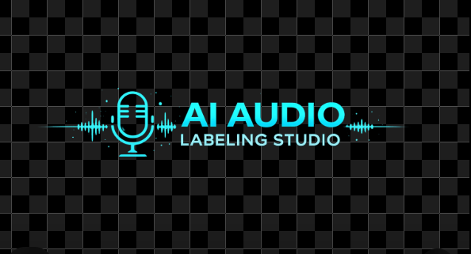

# 🎙️ AI Audio Labeling Studio


A futuristic AI-powered multilingual speech labeling and waveform annotation web application built using **FastAPI**, **WaveSurfer.js**, **HTML/CSS/JS**, and **FFmpeg**.

This project works like a mini combination of:

- Audacity
- ELAN
- Praat
- WhisperX Alignment Tools

Designed specially for:

✅ Marathi  
✅ Hindi  
✅ Gujarati  
✅ English  

speech dataset creation and precise word-level labeling.

---

# ✨ Features

## 🎵 Audio / Video Upload

Supports:

- `.wav`
- `.mp3`
- `.mp4`
- `.mov`
- `.avi`
- `.mkv`

Video files are automatically converted into waveform-compatible WAV audio.

---

# 🌊 Interactive Waveform

Powered by **WaveSurfer.js**

Features:

✅ Real-time waveform visualization  
✅ Audio playback  
✅ Region selection  
✅ Zoom support  
✅ Highlighted word regions  
✅ Precise waveform navigation  
✅ Word-level playback  

---

# 📝 Transcript Word Panel

Upload transcript Excel file.

The system automatically:

✅ Extracts all words  
✅ Displays them in sidebar  
✅ Supports Unicode Indian languages  
✅ Handles Marathi/Hindi/Gujarati text properly  

---

# 🎯 Word-Level Labeling

Current Workflow:

```text
1. Upload Audio/Video
2. Upload Transcript Excel
3. Select Word
4. Select Waveform Region
5. Save Label
6. Export Excel
```

---

# 🚀 Upcoming AI Features

Planned integration:

## 🤖 WhisperX Forced Alignment

Future workflow:

```text
Click Word
→ Automatically detect corresponding audio region
→ Highlight waveform
→ Play detected word
→ Show exact timestamps
```

This will make the system:

✅ Semi-automatic  
✅ Faster labeling  
✅ Research-grade annotation tool  

---

# 📦 Export Features

Export labeled data directly to Excel.

Example Output:

| Word | Start Time | End Time | Start Frame | End Frame |
|------|------------|-----------|-------------|-----------|
| आ | 00:00:00.820 | 00:00:01.120 | 24 | 33 |

---

# 🛠️ Tech Stack

## Backend

- FastAPI
- Python
- Pandas
- OpenPyXL
- FFmpeg

## Frontend

- HTML
- CSS
- JavaScript
- WaveSurfer.js

---

# ⚙️ Installation

## 1️⃣ Clone Repository

```bash
git clone https://github.com/YOUR_USERNAME/ai-audio-labeling-studio.git
```

---

# 2️⃣ Create Virtual Environment

```bash
python -m venv venv
```

---

# 3️⃣ Activate Virtual Environment

## Windows

```bash
venv\Scripts\activate
```

## Linux / Mac

```bash
source venv/bin/activate
```

---

# 4️⃣ Install Dependencies

```bash
pip install -r requirements.txt
```

---

# 5️⃣ Install FFmpeg

Download FFmpeg:

https://www.gyan.dev/ffmpeg/builds/

Add FFmpeg `bin` folder to system PATH.

Verify:

```bash
ffmpeg -version
```

---

# ▶️ Run Project

Go inside backend folder:

```bash
cd backend
```

Run FastAPI server:

```bash
uvicorn main:app --reload
```

---

# 🌐 Open Application

```text
http://127.0.0.1:8000
```

---

# 🧠 Future Roadmap

- WhisperX integration
- Automatic word alignment
- AI-assisted labeling
- Spectrogram view
- Keyboard shortcuts
- Timeline ruler
- Multi-speaker labeling
- Dataset management
- MongoDB integration
- Authentication system
- Cloud deployment

---

# 🔥 Why This Project?

This project is designed for:

✅ Speech Dataset Creation  
✅ ASR Training Data  
✅ Forced Alignment Research  
✅ Indian Language AI  
✅ NLP Research  
✅ Audio Annotation  

Especially useful for:

- Marathi ASR
- Hindi Speech Recognition
- Gujarati Speech AI
- Multilingual NLP

---

# 📸 Screenshots

## 🎵 Waveform Annotation UI

- Futuristic dark theme
- Interactive waveform
- Transcript sidebar
- Word-level labeling workflow

---

# 🤝 Contributing

Contributions are welcome!

Feel free to:

- Open issues
- Submit pull requests
- Suggest features
- Improve UI/UX
- Add AI models

---

# 📜 License

MIT License

---

# 👨‍💻 Author

Developed with ❤️ for multilingual AI speech annotation research.

---

# ⭐ Support

If you like this project:

⭐ Star the repository  
🍴 Fork the project  
🚀 Share with others  

---
